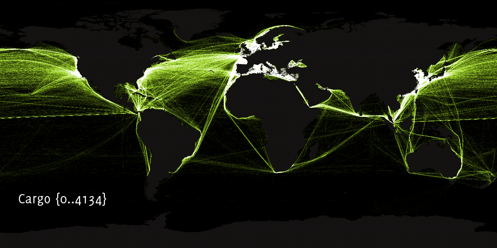
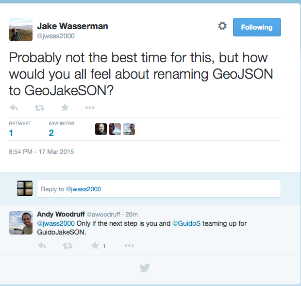

% Spatial Data Formats
% <small>[Shaun Walbridge](http://shaunwalbridge.com) / <a href="https://twitter.com/scw">@scw</a></small>
% <small><a href="https://twitter.com/MaptimeBoston">MaptimeBOS</a> &mdash; 2015-03-18</small>


Download the repo
=================
<h3><a href="https://github.com/scw/maptime-data-formats-2015">https://github.com/scw/maptime-data-formats-2015/</a></h3>

 {data-background="images/halpern-2008.png"}
=

Impacts of Shipping
===================



Job
===

 - Work at <a href="https://www.esri.com">Esri</a> on GIS software for scientific applications
 - Python and R
 - Commercial software + FOSS == ???

I've got plenty of data types, thanks
=====================================

Many existing [data types](https://en.wikipedia.org/wiki/Data_type):

`float` - `int` - `char` - `string` - `timestamp`

. . . 

Can't we just make it with these data types?

Good Ol' CSV, Nothing Beats CSV
===============================

Comma Separated Values

    name, type, latitude, longitude
    BU Bridge, bridge, 49.353, -71.1106
    Prudential Tower, skyscraper, 42.347, -71.082
    'That place where we measured 108.6" of snow', airport, 42.3605, -71.006638

. . .

- A simple tabular structure to store data -- spreadsheet, but without the cruft
- Can upload this data to web mapping sites, or use with something like [GDAL](https://www.gdal.org) to convert it to other formats.

GDAL Interlude
==============

GDAL: translate spatial data between formats.

 - OS X: `brew install gdal`
 - Ubuntu/Debian: `apt-get install gdal`
 - Windows: <span style="text-decoration: line-through">You're SOL</span> try [these binaries](http://www.gisinternals.com/release.php) or [OSGeo4W](http://trac.osgeo.org/osgeo4w/).

. . . 

Everyone uses it, you should too!

Convert Our CSV
===============
    
    cd data/
    # ogr2ogr is confusingly <OUTPUT NAME> <INPUT NAME>
    ogr2ogr -f "GeoJSON" locations.geojson locations.csv

...

(World's tiniest trumpet) -- doesn't work. Why? This 'projection' thing. Which columns are our spatial data

Convert Our CSV
===============

```xml
<OGRVRTDataSource>
    <OGRVRTLayer name="locations">
        <SrcDataSource>locations.csv</SrcDataSource>
        <GeometryType>wkbPoint</GeometryType>
        <LayerSRS>WGS84</LayerSRS>
        <GeometryField encoding="PointFromColumns" x="longitude" y="latitude"/>
    </OGRVRTLayer>
</OGRVRTDataSource>
```
 

What to Know
============

Mapping is 'hard' but don't need to know all the details

[How much math does a GIS analyst need to know?](http://gis.stackexchange.com/questions/6535/how-much-math-does-a-gis-analyst-need-to-know/6549#6549)
 - trigonometry
 - differential geometry
 - topology
 - calculus
 - numerical analysis
 - computer science
 - geometry
 - statistics


A sweet table
=============

Package                                               KLOC     Contributors      Stars
-------                                             ------   --------------    -------
[matplotlib](http://matplotlib.org/)                    63              312       2313
[Nose](http://readthedocs.org/docs/nose/en/latest/)      7               64        744
[NumPy](http://www.numpy.org/)                          84              299       1804
[Pandas](http://pandas.pydata.org)                     112              349       4115
[SciPy](http://scipy.org/scipylib/)                     91              265       1528
[SymPy](http://sympy.org/)                             223              340       1981
Totals                                                 580             1369

 {data-background="images/blank.png"}
===========================

  1. A numberd list with an image in the header


Shapefile
=========

Open specification [whitepaper](XXX)

Resources
=========

Closing {data-background="images/blank.png"}
=======

Thanks
======

 - Maptime Boston
 - CartoDB for the pizza
 - Esri for paying me to nerd out on geospatial

BONUS FORMAT: GeoJakeSON
========================


